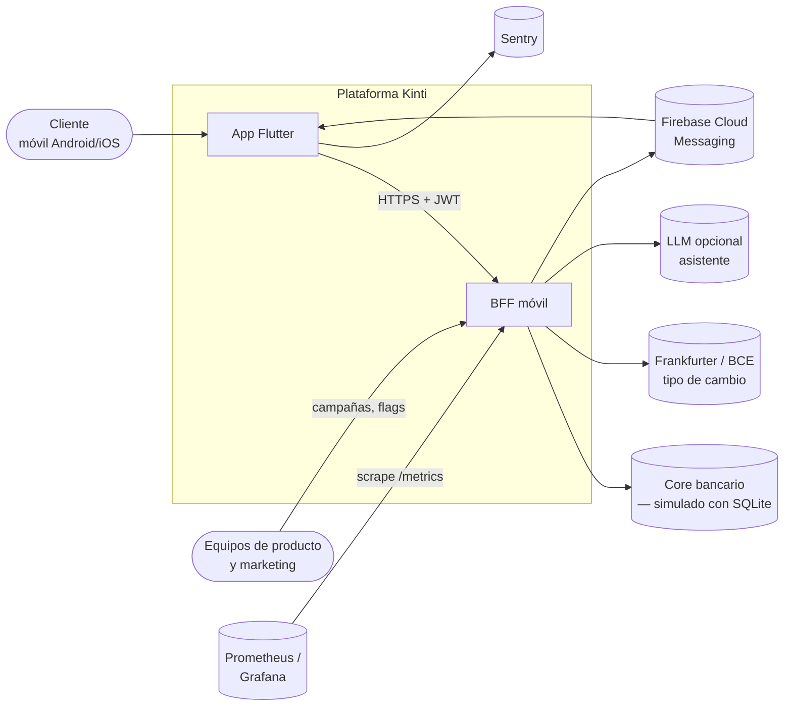
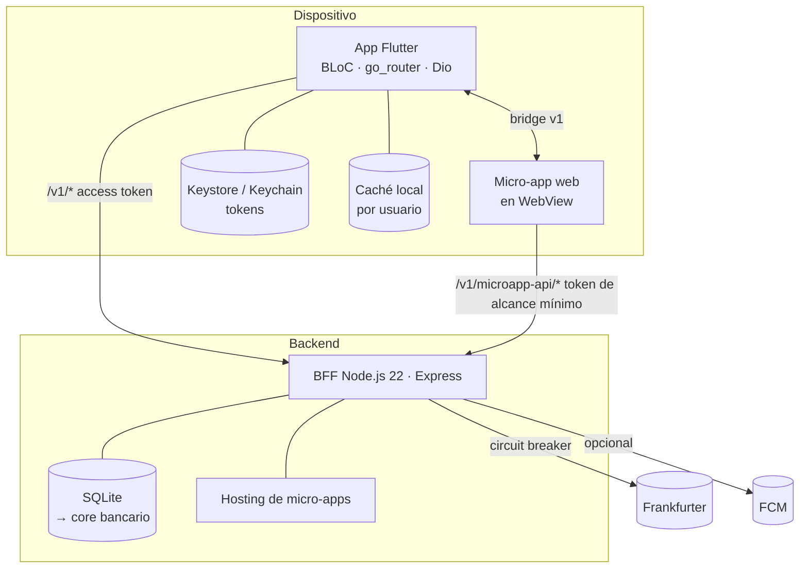
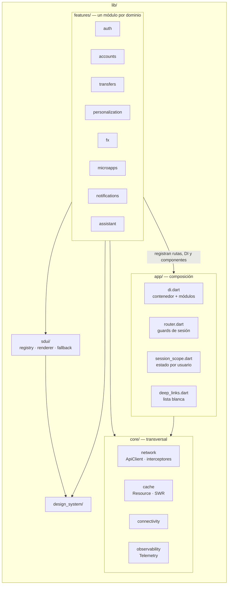
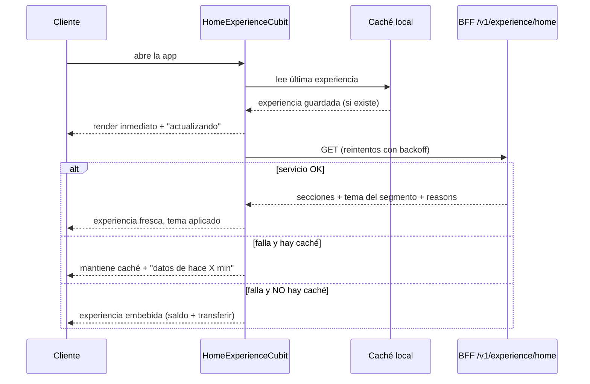
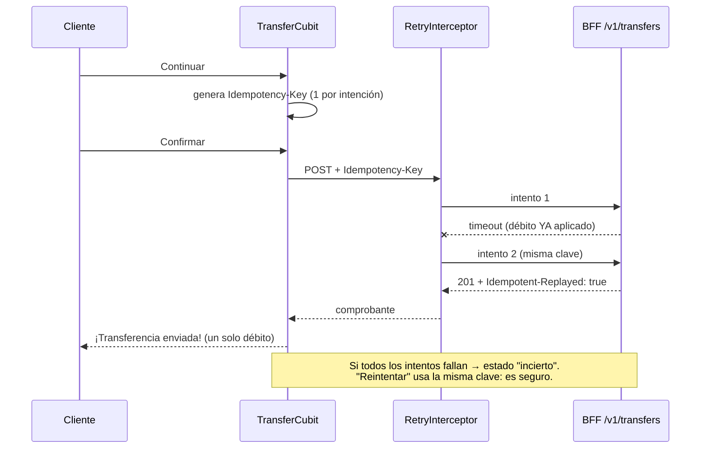
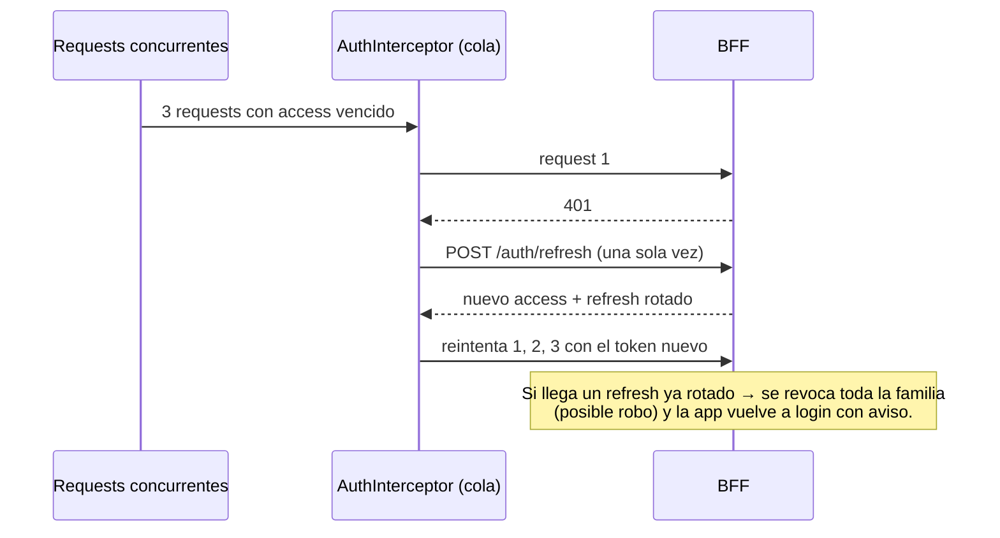
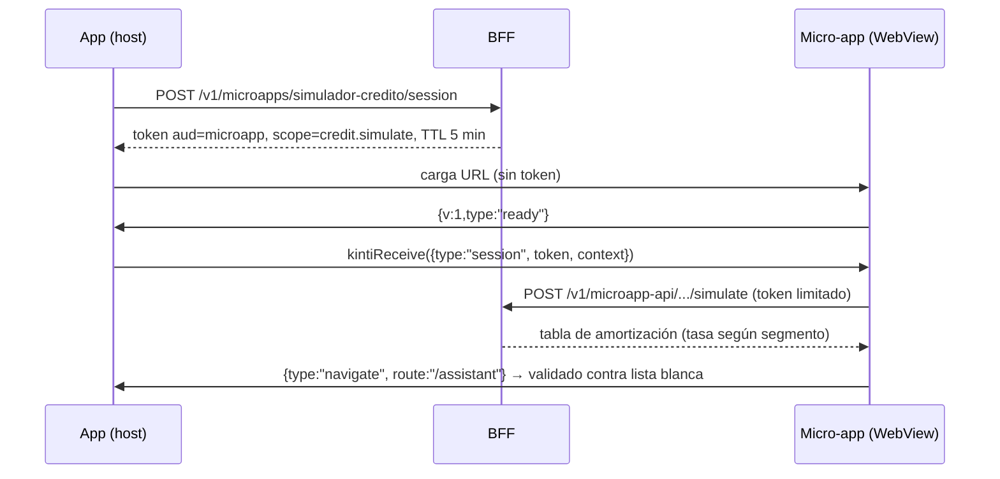
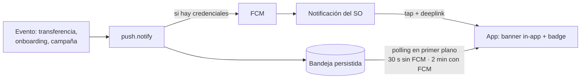

# Arquitectura de Kinti

Kinti es una plataforma financiera 100 % digital: onboarding sin agencia, cuentas y movimientos, transferencias, una experiencia que se adapta a cada cliente y un ecosistema de servicios propios y de terceros. Este documento describe la solución, sus flujos críticos, supuestos, riesgos y estrategia de escalamiento. Las decisiones con sus alternativas descartadas están en [`adr/`](adr/README.md).

## 1. Contexto (C4 nivel 1)

## 2. Contenedores (C4 nivel 2)

| Contenedor | Responsabilidad | Tecnología |
|---|---|---|
| App Flutter | UI nativa, estado, caché offline, resiliencia de red, contenedor de micro-apps, telemetría | Flutter 3.29+, flutter_bloc, go_router, Dio, get_it |
| BFF | Auth, agregación por dominio, SDUI, idempotencia, notificaciones, tokens de micro-apps, fault injection, métricas | Node.js 22, Express, zod, pino, prom-client, `node:sqlite` |
| Micro-app "Simulador financiero" | Servicio de otro equipo con despliegue independiente | HTML/JS estático + API propia en el BFF |

## 3. Componentes de la app (C4 nivel 3)

**Regla de dependencias:** `features → (core, design_system, sdui)`. El núcleo nunca importa features. Las features se comunican por deeplinks y cubits compartidos de sesión, no importando internals de otros dominios (excepto `transfers → accounts.data`, declarado y deliberado).

**Capas dentro de cada dominio:** `data/` (modelos + repositorio, que es el único que conoce HTTP y caché) y `presentation/` (cubits + widgets). Los cubits dependen de repositorios, nunca de Dio.

## 4. Flujos críticos

### 4.1 Inicio personalizado con degradación en tres niveles

### 4.2 Transferencia idempotente (flujo E2E crítico)

### 4.3 Sesión: refresh concurrente y reúso detectado

### 4.4 Micro-app externa

### 4.5 Notificaciones

## 5. Dependencias relevantes

| Dependencia | Uso | Riesgo si falla | Mitigación |
|---|---|---|---|
| Frankfurter (BCE) | Tipo de cambio real | Módulo FX sin datos | Circuit breaker + caché vencida marcada; el resto del inicio no se afecta |
| FCM | Push del SO | Sin push del sistema | Bandeja + polling; canal visible en Ajustes |
| LLM (opcional) | Respuestas del asistente | Sin respuestas generativas | Motor de intenciones determinístico como respaldo; contexto agregado, sin PII |
| WebView del sistema | Micro-apps | Micro-app no carga | Timeout de `ready` (12 s) + error con reintento |
| Core bancario (SQLite en la prueba) | Saldos, movimientos | Sin datos frescos | Caché SWR en la app; outage por dominio demostrable |

## 6. Seguridad

- **Tokens:** access JWT de 15 min y refresh opaco rotativo con detección de reúso por familia. Se guardan en Keystore/Keychain (`flutter_secure_storage`), nunca en preferencias.
- **Contraseñas:** scrypt con sal. Login con rate limit y el mismo mensaje para "usuario no existe" y "contraseña incorrecta".
- **Mínimo privilegio para terceros:** token de micro-app con audiencia y scope propios, entregado por el bridge y no por URL. Mensajes validados y navegación restringida al origen.
- **Datos:** la caché local está aislada por usuario y se borra al cerrar sesión. Sentry con `sendDefaultPii=false`. Logs del BFF con redacción de `authorization`, contraseñas y tokens. El asistente LLM recibe solo agregados.
- **Validación:** zod en el BFF (fuente de verdad) más validación local para feedback inmediato (cédula módulo 10, mayoría de edad, políticas de contraseña).
- **Red:** HTTP en claro solo en builds debug; release exige HTTPS. Pendiente para producción: certificate pinning y detección de root/jailbreak (R-06).

## 7. Supuestos

1. **S-01:** el core bancario se simula con SQLite dentro del BFF. Los repositorios del BFF son el punto de reemplazo por adaptadores al core real.
2. **S-02:** el OTP se devuelve en la respuesta solo con `EXPOSE_OTP=true` (demo). En producción se integra un proveedor SMS y la bandera se desactiva.
3. **S-03:** las transferencias son internas (entre cuentas Kinti). Las interbancarias (SPI/BCE) quedan fuera del alcance.
4. **S-04:** la segmentación usa reglas explícitas y auditables (edad, saldo). En producción vendría de un CDP o modelo.
5. **S-05:** la app apunta a Android e iOS; la micro-app requiere WebView, que no está disponible en Flutter web.

## 8. Riesgos técnicos

| ID | Riesgo | Prob. | Impacto | Mitigación / estado |
|---|---|---|---|---|
| R-01 | Doble débito por reintentos | Media | Crítico | Idempotency-Key extremo a extremo (implementado, con pruebas) |
| R-02 | Esquema SDUI incompatible con versiones viejas de la app | Media | Alto | `schemaVersion`, componentes desconocidos omitidos, caché y fallback embebido |
| R-03 | Micro-app comprometida | Baja | Alto | Token de alcance mínimo, validación de mensajes, restricción de origen |
| R-04 | Caché local sin cifrar en dispositivos rooteados | Media | Medio | Aislamiento por usuario y borrado al logout; cifrado con clave en Keystore en producción |
| R-05 | BFF como punto único de falla | Media | Alto | Stateless salvo la DB; réplicas horizontales detrás de LB, health checks y rollback |
| R-06 | MITM / dispositivos comprometidos | Baja | Alto | HTTPS obligatorio en release; pendiente: pinning, RASP y attestation (Play Integrity / App Attest) |
| R-07 | Crecimiento de la tabla de idempotencia | Alta | Bajo | TTL 24–72 h con job de limpieza |
| R-08 | Dependencia de proveedor FX gratuito | Media | Bajo | Circuit breaker + stale; proveedor contratado con SLA en producción |

## 9. Estrategia de escalamiento

**Tráfico.** El BFF es stateless (JWT), así que escala horizontalmente detrás de un balanceador. Los cuellos de botella en orden:
1. Base de datos: SQLite → PostgreSQL/core real con pool de conexiones y réplicas de lectura para movimientos.
2. Idempotencia y rate limit en almacén compartido (Redis).
3. Caché de la experiencia por segmento + usuario (TTL 5 min, invalidada al cambiar preferencias o campañas).
4. Tipo de cambio cacheado globalmente (ya lo está, TTL 1 h).

**Organización.**
1. Extraer cada `features/<dominio>` a un paquete con CODEOWNERS (ADR-002).
2. Dividir el BFF por dominio detrás de un gateway, manteniendo los paths `/v1/<dominio>`.
3. Publicar el design system y el motor SDUI como paquetes versionados.
4. Registrar aliados en el catálogo de micro-apps con scopes y contrato versionado.

**Producto.**
1. SDUI para más pantallas.
2. Personalización con modelo (CDP + experimentos ya soportados vía buckets estables).
3. Rollouts graduales combinando staged rollout de tiendas, flags y SDUI.
