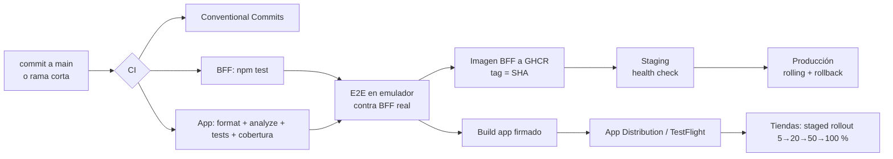

# Estrategia de despliegue y operación

## 1. Entornos

| Entorno | BFF | App | Datos |
|---|---|---|---|
| `dev` | `npm run dev` local o docker-compose | `flutter run --dart-define=FLAVOR=dev` | Semilla determinística |
| `e2e` | Levantado por CI | Emulador Android en CI | Semilla, reiniciada por ejecución |
| `staging` | Render/contenedor, `EXPOSE_OTP=true` | Firebase App Distribution / TestFlight | Semilla |
| `prod` | Contenedores con réplicas, `EXPOSE_OTP=false`, `JWT_SECRET` desde un gestor de secretos | Play Store / App Store con staged rollout | Core real |

La configuración de la app llega por `--dart-define` (`API_BASE_URL`, `FLAVOR`, `SENTRY_DSN`, `DEV_TOOLS`). El BFF se configura por variables de entorno (ver `bff/.env.example`). Ningún secreto de backend se compila en la app.

## 2. Pipeline

- **BFF:** imagen inmutable por commit (`ghcr.io/<owner>/kinti-bff:<sha>`) y despliegue rolling con `HEALTHCHECK` y `/health/ready`. El rollback es redesplegar la imagen anterior. El apagado ordenado (SIGTERM) deja terminar las requests en curso.
- **App:** release candidate por tag. Firma con keystore en secretos de CI. Staged rollout con monitoreo de crash-free sessions antes de avanzar cada etapa. Se detiene ante una regresión.
- **Cambios sin publicar la app:** campañas, orden y contenido del inicio (SDUI), feature flags (kill-switch por módulo), catálogo de micro-apps y versión mínima soportada (`/v1/config.minSupportedVersion`).

## 3. Monitoreo en producción

### 3.1 Señales

| Capa | Fuente | Qué mide |
|---|---|---|
| App · estabilidad | Sentry | Crashes, errores no controlados con `requestId`, breadcrumbs HTTP, ANR |
| App · rendimiento | Sentry performance + métricas de telemetría | Arranque en frío (`cold_start_restore_ms`), latencia HTTP por ruta, `microapp_ready_ms` |
| App · experiencia | Eventos de telemetría | Embudo de onboarding (`onboarding_started` → `_registered` → `_completed`), `login_failed`, `transfer_success/failed` con intentos, `home_fallback_rendered`, `sdui_unknown_component`, `slow_request`, `deeplink_open` bloqueado |
| BFF | Prometheus `/metrics` | `http_request_duration_seconds{route,status}`, `auth_logins_total{result}`, `transfers_total`, `upstream_calls_total{dependency,result}`, `client_events_total` |
| BFF · salud | `/health/ready` | DB y estado del circuit breaker de FX |
| Logs | pino JSON | Un log por request con `reqId`, ruta, status y duración; datos sensibles redactados |

### 3.2 SLOs propuestos

| SLO | Objetivo | Medición |
|---|---|---|
| Disponibilidad de API de cuentas | 99,9 % mensual | 1 − (5xx / total) en `/v1/accounts*` |
| Latencia p95 de lectura | < 800 ms | histograma por ruta |
| Éxito de transferencias (excluye errores de negocio) | 99,5 % | `transfers_total{result="ok"}` vs fallas 5xx |
| Crash-free sessions | ≥ 99,8 % | Sentry |
| Onboarding completado / iniciado | baseline + alerta ante caída > 20 % | eventos de embudo |

### 3.3 Alertas

- **Página (inmediata):** tasa de 5xx > 2 % por 5 min; p95 > 2 s por 10 min; crash-free < 99,5 % en la última release; transferencias fallidas > 1 % por 10 min.
- **Ticket (horario laboral):** circuit breaker de FX abierto > 15 min; `home_fallback_rendered` > 1 % de sesiones; `sdui_unknown_component` > 0 tras publicar campañas (esquema adelantado a la app); caída del embudo de onboarding.

### 3.4 Cómo se detecta y diagnostica un problema de experiencia

1. La alerta o el dashboard muestran, por ejemplo, un aumento de `transfer_failed{type=TimeoutFailure}` en Android 10.
2. En Sentry se filtran los breadcrumbs `http` de esas sesiones y se obtienen los `requestId`.
3. Con el `requestId` se busca en los logs del BFF: ruta, status y latencia de esa request concreta.
4. Si el usuario reporta, la pantalla de error muestra el "Código de soporte" (primeros 8 caracteres del `requestId`), que soporte busca directamente.

## 4. Runbooks

| Síntoma | Acción |
|---|---|
| Proveedor FX caído | Nada urgente: el módulo muestra el último dato. Si dura > 1 h, apagar el módulo con `PUT /v1/admin/flags {"fx": false}` |
| Personalización lenta o caída | La app usa caché o fallback automáticamente. Revisar `/v1/experience` en dashboards. Rollback del BFF si coincide con un deploy |
| Campaña mal configurada | `PATCH /v1/admin/campaigns/:id {"active": false}`: efecto inmediato sin publicar la app |
| Release de app con crash | Pausar staged rollout. Si afecta a un módulo, apagarlo vía flag. Subir `minSupportedVersion` solo si es necesario forzar actualización |
| Sospecha de robo de sesión | La rotación con detección de reúso ya revoca la familia; revisar el log `refresh_token_reuse_detected` |
